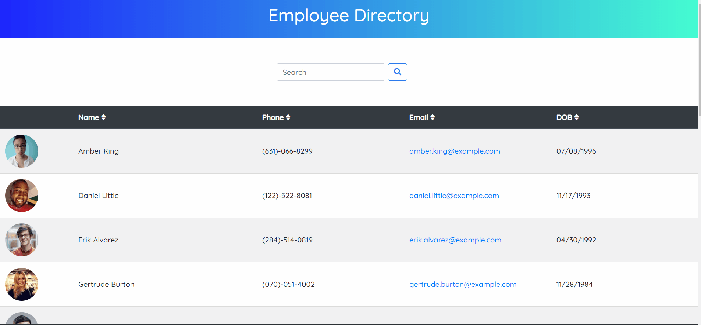

# Employee Directory


### URL: https://darnocer.github.io/React-Employee-Directory/.

## Description

A simple front-end employee directory built with React.

## Table of Contents

- [Installation](#installation)
- [Usage](#usage)
- [Future Enhancements](#future-enhancements)
- [Credits](#Credits)
- [Questions](#questions)

## Installation

```
fork repo
clone to local machine
npm i
npm start
navigate to http://localhost:3000
```

## Usage

1. Click the icons in the column headers to sort or reverse sort each column.

   - Name column sorts by first name
   - DOB column sorts by birth year.

2. Type in the search bar to filter the list of users

   

## Future Enhancements

- Improve handling of sorting - split first and last name columns, better deliniation between ascend and descend
- Improve handling of filter - allow typing of full birthdate
- Styling enhancements

## Credits

- [React](https://reactjs.org/)

- https://randomuser.me/

- [Bootstrap](https://getbootstrap.com/)

## Questions?

Contact me at [darian.nocera26@gmail.com](mailto:darian.nocera26@gmail.com)

or [](http://www.github.com/darnocer)

Copyright © 2020 [Darian Nocera](http://www.github.com/darnocer)

---

##### _Created with [darnocer's README generator](https://github.com/darnocer/Node.js-and-ES6-README-Generator)_ 👽
